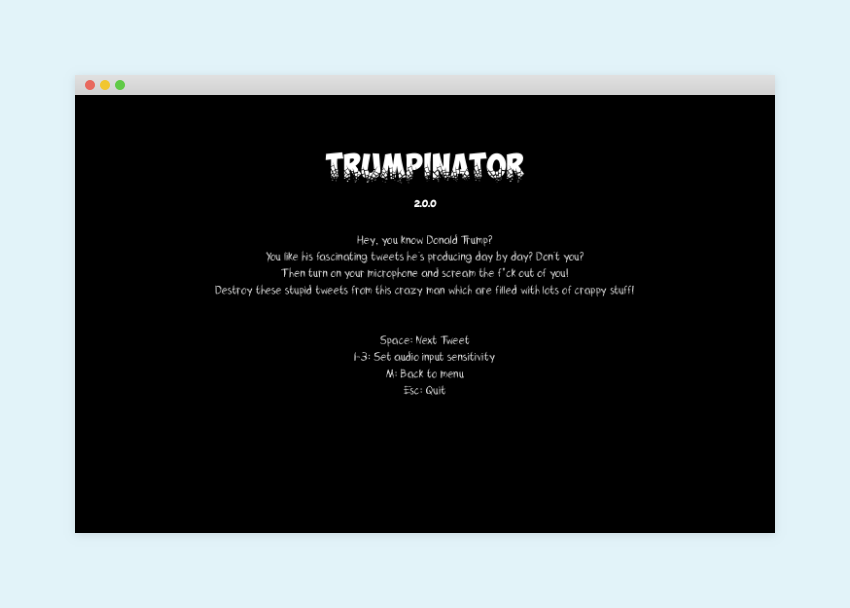

[](https://travis-ci.com/eliashaeussler/trumpinator)
[](LICENSE.md)
[](https://github.com/eliashaeussler/trumpinator/releases/)

# Trumpinator

Welcome to Trumpinator, the world's best opportunity to deal with Donald Trump's statements! Don't you like what he's
talking about on Twitter? No problem, just scream everything you have on your mind inside your computer's mic and it
will destroy all the crappy stuff [@realdonaldtrump](https://twitter.com/realDonaldTrump) is talking about on Twitter!





## What the hell is that?

*Trumpinator* is a new method to help you get rid of your bad mood in relation to Donald Trump. We all know that he's an
unsuitable president and we want him to know our frustration about him. So we decided to develop a tiny program which
reads the lastest 200 tweets of [@realdonaldtrump](https://twitter.com/realDonaldTrump) and enables you to destroy all
of them by screaming inside your computer's mic. You will see, it's freeing! :grin:


## Requirements

* [Java 8+](https://www.java.com/download/)
* [Processing](https://processing.org/)
* Microphone
* Twitter API credentials

### How to create Twitter API credentials

For this app to run, you need valid Twitter API credentials. To get one of them, head to [Twitter Application Management](https://apps.twitter.com/),
sign in (or sign up) and click on `Create New App`. After giving some necessary information, your app will be created.
Now click on the `Keys and Access Tokens` tab and copy the following data:

* Consumer Key (API Key)
* Consumer Secret (API Secret)
* Access Token
* Access Token Secret


## Usage

Clone the repository at first:

```bash
git clone https://github.com/eliashaeussler/trumpinator.git
cd trumpinator
```

Now copy the [`credentials.sample`](trumpinator/credentials.sample) file and provide your Twitter API credentials
(read [here](#how-to-create-twitter-api-credentials) how to get API credentials):

```bash
cp trumpinator/credentials.sample trumpinator/credentials
```

Open the file [`trumpinator/trumpinator.pde`](trumpinator/trumpinator.pde) with Processing.

**Note: All project files and folders need to be inside a folder called `trumpinator` (which they are, by default, after
you have cloned the repository).**

Press `Run` or hit `⌘`+`R` / `Ctrl`+`R`.


## Controls

* `Space`: Show next tweet
* `1-3`: Set audio input sensitivity (from low to high)
* `m`: Show main menu
* `Esc`: Quit program


## Add your own fonts

You can use your own fonts in `ttf` or `otf` format. Just copy them into the `trumpinator/data` folder and have fun :blush:


## Resources

* [Twitter4J](https://github.com/yusuke/twitter4j)
* [Minim](https://github.com/ddf/Minim/)
* Some fonts downloaded from [dafont.com](http://www.dafont.com/)


## License

[MIT License](LICENSE.md)
